# KAGE-Bench: Modern Workflow Guide

<p align="center">
  <a href="https://avanturist322.github.io/KAGEBench/">
    
  </a>
  <a href="https://arxiv.org/abs/2601.14232">
    
  </a>
</p>

<p align="center">
  
  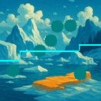
  
  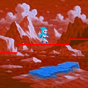
  
  
  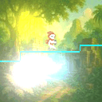
  
</p>

**KAGE-Bench** (Known-Axis Generalization Evaluation Benchmark) is a benchmark environment, written in **Pure JAX**, designed specifically for **visual generalization** research. In this benchmark, agents (policies) make decisions based on high-dimensional **RGB observations**. The core challenge lies in the shift between **training and validation distributions** (Out-of-Distribution generalization). 

The unique "feature" of KAGE-Bench is the ability to **isolate generalization across specific axes** (as defined in `custom_config.yaml`):
- **Backgrounds**: Static colors, procedural noise, or parallax-scrolling images.
- **Characters & NPCs**: Multiple skins (sprites) or geometric shapes with configurable physics and animations.
- **Distractors**: Procedural geometric shapes with independent movement and rotation.
- **Visual Filters**: Standard (brightness, contrast, saturation) and stochastic (jitter, noise, pixelate) effects.
- **Special Effects**: Dynamic point lights with configurable intensity, radius, and falloff.
- **World & Physics**: Procedural floor layouts and physical constants (gravity, ground_friction, jump force).

---

## Roadmap / TODO
- [ ] Add episode truncation condition
- [x] Add standardized .yaml configurations for visual generalization benchmarking
- [ ] Release the package on PyPI
- [x] Provide implementation of popular RL algorithms (PPO, SAC, etc.)

---

## 👋 Table of Contents

| 👋 User Guide | ⚙️ Configuration Reference |
| :--- | :--- |
| 1. [Installation & Setup](#1-installation--setup) | 0. [Base episode settings](#0-base-episode-settings) |
| 2. [Key Features](#2-key-features) | 1. [Global Screen Settings](#1-global-screen-settings) |
| 3. [Environment Specification](#3-environment-specification) | 2. [Different backgrounds](#2-different-backgrounds) |
| 4. [Quickstart: Configuration & YAML](#4-quickstart-configuration--yaml) | 3. [Agent's appearance](#3-agents-appearance) |
| 5. [Massively Parallel Environments (JAX vmap)](#5-massively-parallel-environments-jax-vmap) | 4. [NPCs](#4-npcs) |
| 6. [Gymnasium Wrapper](#6-gymnasium-wrapper) | 5. [Distractors](#5-distractors) |
| 7. [AutoReset Wrapper (JAX-native)](#7-autoreset-wrapper-jax-native) | 6. [Filters](#6-filters) |
| 8. [RL Training Recommendations](#8-rl-training-recommendations) | 7. [Effects](#7-effects) |
| 9. [Scripts & Tools](#9-scripts--tools) | 8. [Level Layout](#8-level-layout) |
| 10. [Training, Metrics, and Plots](#10-training-metrics-and-plots) | 9. [Physics](#9-physics) |

---

## 1. Installation & Setup

### Using `uv` (Recommended)
[uv](https://github.com/astral-sh/uv) is the fastest way to manage dependencies.

```bash
# Clone the repository
git clone https://github.com/kage_bench/kage_bench.git
cd kage_bench

# Standard install (CPU)
uv sync
```

### Installation Extras
You can customize the installation by adding extras:
- **`cuda`**: Essential for Linux/Windows users with NVIDIA GPUs. Installs JAX with CUDA support.
- **`gymnasium`**: Adds the Gymnasium wrapper for compatibility with SB3, CleanRL, etc.
- **`human-play`**: Installs `pygame`, allowing you to play the environment manually.
- **`video`**: Installs `imageio` and `ffmpeg` for saving high-quality MP4 recordings.
- **`train`**: Installs training dependencies (`torch`, `tensorboard`, `wandb`, etc.).
- **`dev`**: Installs testing and linting tools (`pytest`, `black`, `ruff`).

Example:
```bash
uv sync --extra cuda --extra gymnasium
```

Training dependencies via `uv`:
```bash
uv sync --train
```

### Using `pip`
```bash
# Clone the repository
git clone https://github.com/kage_bench/kage_bench.git
cd kage_bench

# Standard install (CPU)
pip install -e .

# With GPU support (Linux/Windows only)
pip install -e ".[cuda]"

# All extras
pip install -e ".[cuda,gymnasium,human-play,video,dev]"
```
---

## 2. Key Features

- **Pure Functional Core**: All state is immutable, making it perfect for JAX.
- **Massively Parallel**: Scale up to **2^15** (32,768) environments on a single GPU (reaching **7,000,000 FPS**).
- **YAML-Driven**: Every aspect of the environment (physics, visuals, NPCs) is configurable via YAML.
- **Visual Diversity**: Procedural backgrounds, lighting effects, and different NPC behaviors for OOD generalization testing.
- **Gymnasium Compatible**: Shims for standard RL libraries.

---

## 3. Environment Specification

- **Observation Space**: `Box(0, 255, (H, W, 3), uint8)`
  - Default resolution: **128x128 RGB**.
- **Action Space**: `Discrete(8)`
  - Bitmask of `[Jump, Right, Left]`:
    - `0`: Idle
    - `1`: Left
    - `2`: Right
    - `4`: Jump
    - `5`: Jump + Left
    - `6`: Jump + Right
    - `7`: Jump + Idle

---

## 4. Quickstart: Configuration & YAML

The environment is designed to be controlled primarily through `.yaml` files. 

### The Master Config
The primary reference for all available settings is **`src/kage_bench/configs/default_config.yaml`**. 
- **Documentation**: Every parameter in that file is commented with its range, effect, and default value.
- **Customization**: When creating your own config, you only need to override the specific keys you want to change; the rest will be inherited from the defaults.

### Loading a Config
```python
from kage_bench import KAGE_Env, load_config_from_yaml

# Load your custom settings
config = load_config_from_yaml("custom_config.yaml")

# Initialize the environment
env = KAGE_Env(config)
```

### Running a Base Loop
```python
import jax
import jax.numpy as jnp

# 1. Reset (requires PRNG key)
key = jax.random.PRNGKey(0)
obs, info = env.reset(key)
state = info["state"]

# 2. Step (stateless)
# Action 1=Left, 2=Right, 4=Jump (bitmask)
obs, reward, terminated, truncated, info = env.step(state, jnp.int32(2))
next_state = info["state"]
```

---

## 5. Massively Parallel Environments (JAX vmap)

To leverage JAX's full power, you should vectorize the environment functions to run thousands of instances in parallel on GPU or CPU.

```python
import jax
from kage_bench import KAGE_Env, load_config_from_yaml

env = KAGE_Env(load_config_from_yaml("custom_config.yaml"))

# Vectorize and JIT compile
reset_vec = jax.jit(jax.vmap(env.reset))
step_vec = jax.jit(jax.vmap(env.step))

# Initialize 1024 parallel environments
N_ENVS = 1024
keys = jax.random.split(jax.random.PRNGKey(42), N_ENVS)

# Reset all at once
obs, info = reset_vec(keys)
states = info["state"]

# Parallel step
actions = jax.random.randint(keys[0], (N_ENVS,), 0, 8)
obs, rewards, terms, truncs, info = step_vec(states, actions)
states = info["state"]

print(f"Observation batch shape: {obs.shape}") # (1024, 128, 128, 3)
```

---

## 6. Gymnasium Wrapper

If you are using standard RL libraries like Stable Baselines3 or CleanRL, use the Gymnasium wrapper. It maintains an internal state but remains JIT-fast. You can either build from a YAML config or wrap an existing `KAGE_Env`.


```python
from kage_bench import EnvConfig, KAGE_Env
from kage_bench.wrappers import GymnasiumWrapper

# Wrap an existing KAGE_Env
jax_env = KAGE_Env(EnvConfig())
env = GymnasiumWrapper(jax_env, render_mode="rgb_array")

obs, info = env.reset(seed=42)
for _ in range(1000):
    action = env.action_space.sample()
    obs, reward, terminated, truncated, info = env.step(action)
    if terminated or truncated:
        obs, info = env.reset()
```

---

## 7. AutoReset Wrapper (JAX-native)

For efficient RL training loops in JAX, you need the environment to reset itself immediately after termination without leaving the JIT-compiled loop.

```python
from kage_bench.wrappers import AutoResetWrapper

# Wrap the base environment
env = KAGE_Env(load_config_from_yaml("custom_config.yaml"))
env = AutoResetWrapper(env)

# Now step requires a key for potential reset randomization
obs, reward, term, trunc, info = jax.jit(env.step)(state, action, key)
# If term or trunc is True, 'obs' and 'info["state"]' are already from the NEW episode.
```

---

## 8. RL Training Recommendations

For the fastest possible training, we recommend a **PureJAX** approach where both the environment and the learner reside inside a single JIT function.

### Preferred Loop Structure
The most efficient way to train is to use `jax.lax.scan` to iterate over steps and `jax.vmap` to handle multiple environments.

1.  **Vectorization**: Use `jax.vmap(env.step)` to run 128-4096 environments in parallel.
2.  **AutoReset**: Use `AutoResetWrapper` for continuous training. By default, the environment is **episodic** where each episode has a fixed duration (no early termination/truncation signals), though support for dynamic truncation is planned for future development.
3.  **Scan**: Use `jax.lax.scan` to run a "rollout" of $N$ steps entirely on the GPU. This eliminates Python overhead during the collection phase.
4.  **Single JIT**: Compile your entire `update` function (collection + policy update) into one JIT-call.


## 9. Scripts & Tools

The `scripts/` directory contains various tools for performance benchmarking, visualization, and testing.

### Performance Benchmarking
Measure the throughput of the environment under different configurations:
```bash
# Simplest possible configuration (no NPCs, no filters, minimal visuals)
uv run python3 scripts/bench_vectorized.py --config scripts/fps_bench_configs/simplest_config.yaml --n_envs 1024

# Hardest configuration (max NPCs, sticky NPCs, distractors, filters, lights)
uv run python3 scripts/bench_vectorized.py --config scripts/fps_bench_configs/hardest_config.yaml --n_envs 1024
```

### Interactive Play
Manually test physics and visuals using your keyboard:
```bash
uv run python3 scripts/play_human.py custom_config.yaml
```

### Visualization & Demos
Save videos of trajectories or see how AutoReset works:
```bash
# Save a 500-step video of random actions to tmp/video.mp4
uv run python3 scripts/create_video.py custom_config.yaml --steps 500 --output tmp/video.mp4

# Run a localized demo of AutoReset and LogWrapper logic
uv run python3 scripts/demo_autoreset.py

# Verify rendering and save a single sample observation
uv run python3 scripts/verify_render.py

# Test step info, success flags, and episode transitions
# Prints `success` / `success_once` in the step info based on `dist_to_success`
uv run python3 scripts/test_step_info.py --config custom_config.yaml --steps 50 --seed 123

# Test step info for gymnasium wrapper
uv run python3 scripts/test_step_info_gymnasium.py --config custom_config.yaml --steps 50 --seed 123
```

---
# 10. Training, Metrics, and Plots
This section covers how to launch PPO-CNN training, run the generalization benchmark sweep, and turn the resulting runs into consolidated metrics and plots.

## 10.1 Training a single PPO-CNN experiment
Run `rl_algorithms/jax/ppo_jax.py` with both a train and eval config to collect a controlled pair of runs. Swap the train/eval paths to match the axis or seed you intend to explore; the CSV files under `benchmark/kage_bench_configs/<group>` document the available combinations.
If you plan to run on CUDA, make sure you have installed the GPU extras via `uv sync --extra cuda` before launching the script so the proper JAX/CUDA stack is available.

```bash
# Start training of PPO-CNN (JAX) across custom train and eval configs
uv run rl_algorithms/jax/ppo_jax.py \
  --train-config-path "benchmark/kage_bench_configs/background/config_4_train.yaml" \
  --eval-config-path "benchmark/kage_bench_configs/background/config_4_eval.yaml"

# Log to Weights & Biases with a custom experiment name
uv run rl_algorithms/jax/ppo_jax.py \
  --exp-name configs_analysis/config_1 \
  --train-config-path "configs/config_1_train.yaml" \
  --eval-config-path "configs/config_1_val.yaml" \
  --track --wandb-project-name kage-test
```

## 10.2 Benchmarking across all configs
`benchmark/bench_generalization_ppo_jax.sh` automates launching PPO experiments across every config in a generalization axis. It writes its checkpoints/logs into `runs/ppo_jax/<config_group>/<seed>` so you can trace results after the sweep.

```
# Usage
bash benchmark/bench_generalization_ppo_jax.sh <config_group> [seed_end] [config_ids...]
bash benchmark/bench_generalization_ppo_jax.sh <config_group> <seed_start> <seed_end> [config_ids...]
```

- `config_group`: one of the folders from `benchmark/kage_bench_configs` (e.g., `filters`, `background`).
- `seed_start`/`seed_end`: optional range (inclusive) of seeds to cover; defaults to `1..10`.
- `config_ids`: optional list of specific configs within the group to run; if omitted, the script iterates every config file in the group.

Examples:

```bash
# runs every filter config with seeds 1..10
bash benchmark/bench_generalization_ppo_jax.sh filters

# runs every filter config with seeds 1..3
bash benchmark/bench_generalization_ppo_jax.sh filters 3

# runs configs 1, 4, 7 of filters with seeds 1..5
bash benchmark/bench_generalization_ppo_jax.sh filters 1 5 1 4 7
```

Quick sweeps per axis:
```bash
bash benchmark/bench_generalization_ppo_jax.sh agent_appearance
bash benchmark/bench_generalization_ppo_jax.sh background
bash benchmark/bench_generalization_ppo_jax.sh distractors
bash benchmark/bench_generalization_ppo_jax.sh effects
bash benchmark/bench_generalization_ppo_jax.sh filters
bash benchmark/bench_generalization_ppo_jax.sh layout
```

## 10.3 Metrics & plots
After your benchmarking sweep completes, use the helper scripts under `benchmark/` to aggregate metrics and visualize performance.

- `benchmark/get_metrics_from_runs.py` averages metric logs across each unique config/seed pair and drops a summary at `tmp/generalization_metrics_summary.csv`.
- `benchmark/get_axis_metrics.py` folds those summaries into axis-level statistics (`tmp/generalization_axis_metrics.csv` by default).
- `benchmark/plot_all_configs.py` reads the same CSV and renders every training curve into `plots/`.

```bash
# Average metrics across seeds for each config
uv run python benchmark/get_metrics_from_runs.py

# Aggregate metrics across generalization axes
uv run python benchmark/get_axis_metrics.py \
  --input tmp/generalization_metrics_summary.csv \
  --output tmp/generalization_axis_metrics.csv

# Plot every training curve
uv run python benchmark/plot_all_configs.py
```

## 10.4 Throughput benchmarking (easy/hard modes)
`benchmark/benchmark_throughput.sh` measures FPS throughput across powers of two environment counts so you can compare execution speed under light and heavy visuals. It launches `scripts/bench_vectorized.py` three times per `n_envs`, averages the FPS, and records detailed TSV and YAML summaries in `tmp/throughput_results_{easy|hard}`.

- **easy mode**: `benchmark/benchmark_throughput.sh easy` uses `scripts/fps_bench_configs/simplest_config.yaml` to isolate simulation throughput without distractors or filters.
- **hard mode**: `benchmark/benchmark_throughput.sh hard` uses `scripts/fps_bench_configs/hardest_config.yaml` (distractors, filters, and NPCs enabled) to measure worst-case rendering and physics cost.

```bash
# light-weight visuals
benchmark/benchmark_throughput.sh easy

# stress-test complex visuals
benchmark/benchmark_throughput.sh hard
```

Each mode dumps `throughput_summary.tsv` (tabular mean/std per `n_envs`) and appends run-level stats to `throughput_summary.yaml` so you can chart the scaling profile for that mode. Verify `uv sync --extra cuda` has already been run if you expect these measurements to use your GPU hardware; otherwise, the scripts fall back to CPU-only JAX builds.
Outputs are written under `tmp/throughput_results_{easy|hard}/throughput_summary.yaml`.

---

# 0. Base episode settings
```yaml
episode_length: 500        # Default: 500 | Max steps per episode
forward_reward_scale: 0.2  # Default: 0.2 | Reward for moving forward
jump_penalty: 10.0         # Default: 10.0 | Penalty for jumping
timestep_penalty: 0.1      # Default: 0.1 | Per-timestep reward penalty
idle_penalty: 5.0          # Default: 5.0 | Penalty when x does not change
dist_to_success: 490.0     # Default: 490.0 | Passed distance needed for success
```
`info` contains two success indicators: `success` is true when `passed_distance >= dist_to_success` (and can flip back to false if the agent runs backward), while `success_once` stays true once that threshold has been hit.

# 1. Global Screen Settings
```yaml
H: 128  # Default: 128 | Screen height in pixels
W: 128  # Default: 128 | Screen width in pixels
```

# 2. Different backgrounds
Available background types: 'black', 'image', 'noise', 'color'

## 2.1. Black background
<p align="center">
  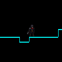
</p>

```yaml
background:
  mode: "black"
```

## 2.2. Image background (128 images)
<p align="center">
  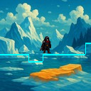
  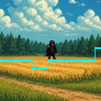
  
  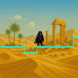
  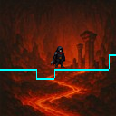
  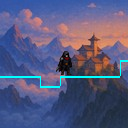
  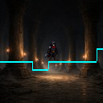
  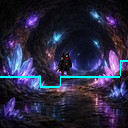
</p>

```yaml
background: # Directory of images
  mode: "image"
  image_dir: "src/kage_bench/assets/backgrounds"
```
```yaml
background: # List of selected images
  mode: "image"
  image_paths: 
    - "src/kage_bench/assets/backgrounds/bg-1.jpeg"
    - "src/kage_bench/assets/backgrounds/bg-64.jpeg"
    - "src/kage_bench/assets/backgrounds/bg-128.jpeg"
```
```yaml
background: # Single image
  mode: "image"
  image_path: "path/to/your/image.jpeg"
```

Additionally, in `image` mode you can control the parallax effect, tiling, and background images switching frequency:
```yaml
background:
  mode: "image"
  # Parallax/Tiling (ignored if mode != "image")
  parallax_factor: 0.5   # Default: 0.5 | 0.0 = static, 0.5 = slow scroll, 1.0 = locked to camera, <0 = moves left, >1 = moves fast
  tile_horizontal: true  # Default: true | Repeat image horizontally for infinite worlds
  
  # Dynamic switching (change background during the episode \ gif effect)
  switch_frequency: 0.0  # Default: 0.0 | Probability per step (0.0 = never switch, 1.0 = every step)
```

## 2.3. Noise background
<p align="center">
  
  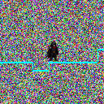
  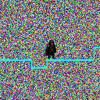
  
  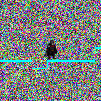
  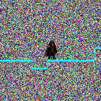
  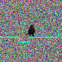
  
</p>

```yaml
background:
  mode: "noise"
```

## 2.4. Color background (16 colors)
<p align="center">
  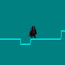
  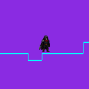
  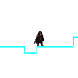
  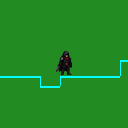
  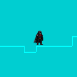
  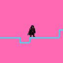
  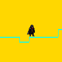
  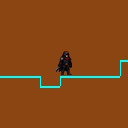
</p>

```yaml
background:
  # Available colors: 
    # "black", "white", "red", "orange", "yellow", "green", "cyan", "blue", 
    # "purple", "pink", "brown", "gray", "lime", "teal", "indigo", "magenta"
  mode: ["purple", "teal", "indigo"]
```


# 3. Agent's appearance
## 3.1. Sprite appearance (27 animated sprites)
<p align="center">
  
  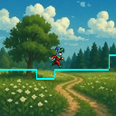
  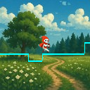
  
  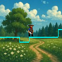
  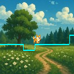
  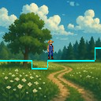
  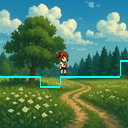
</p>

```yaml
character: # Directory of sprites
  use_sprites: true
  sprite_dir: "src/kage_bench/assets/sprites"
```

```yaml
character: # List of selected sprites
  use_sprites: true
  sprite_paths:
    - "src/kage_bench/assets/sprites/clown"         # Skin 1
    - "src/kage_bench/assets/sprites/dark_knight"   # Skin 2
    - "src/kage_bench/assets/sprites/skeleton"      # Skin 3
```

```yaml
character: # Single sprite
  use_sprites: true
  sprite_path: "path/to/your/folder/with/sprite"
```

Additionally, in `sprite` mode you can control the animation settings:
```yaml
character:
  use_sprites: true
  # Animation settings (ignored if use_sprites: false):
  enable_animation: true  # Default: true | Enable sprite animation (if false, use only first frame)
  animation_fps: 12.0     # Default: 12.0 | Frames per second for sprite animation
  idle_sprite_idx: 0      # Default: 0 | Which sprite to use when idle (typically first)
```

## 3.2. Geometric figure appearance 
### 3.2.1. Shapes (9 geometric figures)
<p align="center">
  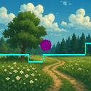
  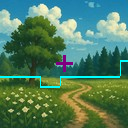
  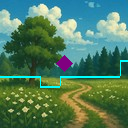
  
  
  
  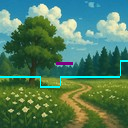
  
</p>

```yaml
character:
  use_shape: true
  shape_types: ["circle", "star"]
  shape_colors: ["purple"]
```

Additionally, in `shape` mode you can control the agent rotation settings:
```yaml
character:
  use_shape: true
  shape_rotate: true        # Default: true | Enable shape rotation
  shape_rotation_speed: 5.0 # Default: 5.0 | Rotation speed in degrees per second
```

### 3.2.2. Colors (21 colors)
<p align="center">
  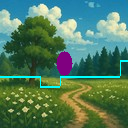
  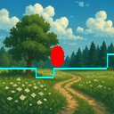
  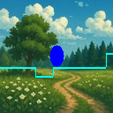
  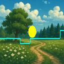
  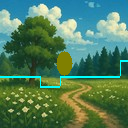
  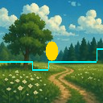
  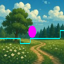
  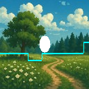
</p>

```yaml
character:
  use_shape: true
  shape_types: ["ellipse"]
  shape_colors: ["teal", "indigo"]
```

# 4. NPCs
World-Fixed NPCs (left) and Sticky NPCs (right)
<p align="center">
  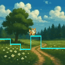
  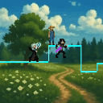
</p>

```yaml
npc:
  # Default: true | Enable NPC system:
  # * World-Fixed NPCs (stand on platforms)
  enabled: false       # Default: true | Enable World-Fixed NPC system:
  min_npc_count: 5    # Default: 5 | Minimum number of NPCs per level
  max_npc_count: 20   # Default: 20 | Maximum number of NPCs per level
  spawn_y_offset: 0   # Default: 0 | Offset from ground in pixels (positive = up, negative = down)
  animation_fps: 12.0 # Default: 12.0 | Animation speed for NPCs
  
  # * Please, choose only one of the following options sprite_dir, sprite_paths, sprite_path:
  # [Option 1] Specify a directory to auto-discover all sprite subdirectories:
  sprite_dir: "src/kage_bench/assets/sprites"  # Will auto-discover all subdirs like robot/, girl/, skelet/, etc.

  # [Option 2] Or specify list of explicit paths:
  # sprite_paths:
  #   - "src/kage_bench/assets/sprites/clown"         # Skin 1
  #   - "src/kage_bench/assets/sprites/dark_knight"   # Skin 2
  #   - "src/kage_bench/assets/sprites/skeleton"        # Skin 3

  # [Option 3] Or force a single sprite directory:
  # sprite_path: "path/to/your/folder/with/sprite"

  # * Sticky NPCs (follow camera and always visible in observation):
  sticky_enabled: false  # Default: false | Enable sticky NPC system:
  min_sticky_count: 1    # Default: 1 | Minimum number of sticky NPCs per level
  max_sticky_count: 5    # Default: 5 | Maximum number of sticky NPCs per level
  # * Please, choose only one of the following options sticky_sprite_dir, sticky_sprite_dirs, sticky_sprite_path:
  # [Option 1] Specify a directory to auto-discover all sticky sprite subdirectories:
  sticky_sprite_dir: "src/kage_bench/assets/sprites"  # Will auto-discover all subdirs

  # [Option 2] Or specify list of explicit paths (backward compatibility):
  # sticky_sprite_dirs: # * Will use only listed sprite directories
  #   - "src/kage_bench/assets/sprites/clown"         # Skin 1
  #   - "src/kage_bench/assets/sprites/dark_knight"   # Skin 2
  #   - "src/kage_bench/assets/sprites/skeleton"        # Skin 3

  # [Option 3] Or force a single sticky sprite directory:
  # sticky_sprite_path: "path/to/your/folder/with/sprite"

  # Sticky NPCs settings:
  sticky_can_jump: true          # Default: true | Enable jumping for sticky NPCs
  sticky_jump_probability: 0.01  # Default: 0.01 | Probability of jumping per step
  sticky_y_min_offset: -40       # Default: -40  | Minimum Y offset from ground (negative = higher)
  sticky_y_max_offset: -10       # Default: -10  | Maximum Y offset from ground (0 = on ground)
  sticky_x_offsets: []           # Default: []   | Camera-relative X offsets for sticky NPCs (e.g., [-40, 0, 40]). If not provided, NPCs will be spread around agent
  sticky_x_min: -60              # Default: -60  | Minimum X offset from center
  sticky_x_max: 60               # Default: 60   | Maximum X offset from center
```

# 5. Distractors
In the left GIF, the agent is represented by a sprite, and the distractors are geometric shapes. In the right GIF, the agent is represented by a geometric shape, and the distractors are also geometric shapes.
<p align="center">
  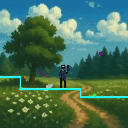
  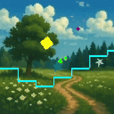
</p>


```yaml
distractors:
  # Whether to enable distractors, i.e. moving geometric shapes on background (always visible in observation)
  enabled: false # Default: false | Enable distractors system:
  count: 5      # Default: 5 | Number of distractors per level
  
  # Available shapes:
    # "circle", "cross", "diamond", "ellipse", 
    # "line", "polygon", "square", "star", "triangle"
  shape_types: ["circle", "star", "cross"]

  # Available colors:
    # "red", "green", "blue", "orange", "yellow", "violet", "magenta", 
    # "cyan", "pink", "brown",  "purple", "lime", "navy", "maroon", 
    # "olive", "teal", "indigo", "coral", "gold", "silver", "white"
  shape_colors: ["red", "green", "blue"]
  
  # Dynamics:
  can_move: true           # Default: true | Whether distractors move around
  min_speed: 0.0           # Default: 0.0 | Minimum movement speed (pixels per step)
  max_speed: 1.0           # Default: 2.0 | Maximum movement speed (pixels per step)
  can_rotate: true         # Default: true | Whether distractors rotate
  min_rotation_speed: -0.3 # Default: -3.0 | Minimum rotation speed (degrees per step)
  max_rotation_speed: 0.3  # Default: 3.0 | Maximum rotation speed (degrees per step)
  min_size: 4              # Default: 4 | Minimum size
  max_size: 12             # Default: 12 | Maximum size
```

# 6. Filters
## 6.1. Individual filters (14 filters)
<p align="center">
  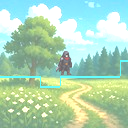
  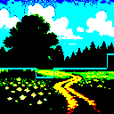
  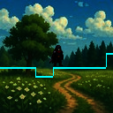
  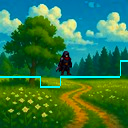
  
  
  
  
</p>

<p align="center">
  
  
  
  
  
  
  
  
</p>

```yaml
filters:
  brightness: 0.0        # Default: 0.0 | [-1, 1] additive exposure, scaled in code
  contrast: 1.0          # Default: 1.0 | >0, scales around mid-gray (128)
  gamma: 1.0             # Default: 1.0 | [0.5, 2.0] power-law on [0,1]
  saturation: 1.0        # Default: 1.0 | [0, 2] HSV S multiplier
  hue_shift: 0.0         # Default: 0.0 | [-180, 180] degrees, HSV hue offset
  color_temp: 0.0        # Default: 0.0 | [-1, 1] warm(+R,-B) vs cool(+B,-R)

  # Stochastic effects (require PRNG key):
  color_jitter_std: 0.0    # Default: 0.0 | >=0, std of 3x3 RGB mixing perturbation
  gaussian_noise_std: 0.0  # Default: 0.0 | >=0, pixelwise N(0, std^2) in [0,255]
  poisson_noise_scale: 0.0 # Default: 0.0 | [0,1], shot noise with lambda = img*scale
  
  # Spatial / detail transforms:
  blur_sigma: 0.0        # Default: 0.0 | >=0, box-blur approximation strength
  sharpen_amount: 0.0    # Default: 0.0 | >=0, unsharp mask gain
  pixelate_factor: 1     # Default: 1 | int>=1, down/up nearest (1 disables)

  # Global shading / lighting overlays:
  vignette_strength: 0.0     # Default: 0.0 | >=0, edge darkening factor (code expects ~[0,1])
  radial_light_strength: 0.0 # Default: 0.0 | >=0, additive center light (code expects ~[0,1])
```

## 6.2. Filter presets
<p align="center">
  
  
  
  
  
</p>

```yaml
filters:
  pop_filter_list: [] # ["vintage","retro","cyberpunk","horror","noir"]
```

# 7. Effects
<p align="center">
  
  
  
  
  
  
  
  
</p>

```yaml
effects:
  # Point light effect
  point_light_enabled: false  # Default: false | Enable/disable point light effects
  point_light_intensity: 1.0  # Default: 1.0 | Light intensity in [0.1, 5.0]
  point_light_radius: 0.1     # Default: 0.1 | Light radius as fraction of image size [0.01, 1.0]
  point_light_falloff: 2      # Default: 2.0 | Falloff exponent in [1.0, 4.0], higher = sharper

  # Multiple random lights
  point_light_count: 4        # Default: 1 | Number of lights in [1, 5]

  # Available colors:
    # `warm_white`, `cool_white`, `yellow`, `orange`, `red`, 
    # `green`, `cyan`, `blue`, `purple`, `pink`, `gold`, `fire`
  point_light_color_names: ["blue", "pink", "gold"]   # Default: ["warm_white"] | List of color names from LIGHT_COLORS
```

# 8. Level Layout
```yaml
layout:
  length: 2048            # Default: 2048 | Length of the level in pixels
  height_px: 128          # Default: 128 | Height of the level in pixels
  base_ground_y: 96       # Default: 96 | [70, 127] Hight of the ground level. Higher - lower ground level
  pix_per_unit: 2         # Default: 2 | [0, 3] Pixels per height unit. 0 - flat, 3 - larger steps
  ground_thickness: 2     # Default: 2 | [1, 10] Thickness of the ground band in pixels
  run_width: 25           # Default: 20 | [1, 60] Widths of the stair in pixels
  p_change: 0.7           # Default: 0.7 | [0, 1] Probability of height change. 0 -never change, 1 -always change
  p_up_given_change: 0.5  # Default: 0.5 | [0, 1] Probability of height increase given height change. 0 -always decrease, 1 -always increase
  min_step_height: 5      # Default: 5 | [1, 17] Minimum height of the step in pixels
  max_step_height: 17     # Default: 10 | [1, 17] Maximum height of the step in pixels

  # Colors for platforms (randomly selected per episode)
  # Available colors: 
    # "black", "white", "red", "orange", "yellow", "green", "cyan", "blue", 
    # "purple", "pink", "brown", "gray", "lime", "teal", "indigo", "magenta"
  layout_colors: ["cyan"] # Default: ["cyan"] | List of color names from COLOR_PALETTE
```

# 9. Physics
```yaml
physics:
  gravity: 0.75         # Default: 0.75 | [0.1, 1.0] Gravity force
  move_speed: 1         # Default: 1 | int and > 1 | Move speed 
  jump_force: -7.5      # Default: -7.5 | [-10.0, 0.0] Jump force. Negative is upwards
  ground_friction: 0.8  # Default: 0.8 | [0.1, 1.0] Friction force
  air_resistance: 0.95  # Default: 0.95 | [0.1, 1.0] Air resistance force
  max_fall_speed: 8.0   # Default: 8.0 | [0.1, 10.0] Maximum fall speed
```

---

## License

MIT License - see LICENSE file for details.


## Citation
If you find our work useful, please feel free to cite it.
```bibtex
@misc{cherepanov2026kage,
      title={KAGE-Bench: Fast Known-Axis Visual Generalization Evaluation for Reinforcement Learning}, 
      author={Egor Cherepanov and Daniil Zelezetsky and Alexey K. Kovalev and Aleksandr I. Panov},
      year={2026},
      eprint={2601.14232},
      archivePrefix={arXiv},
      primaryClass={cs.LG},
      url={https://arxiv.org/abs/2601.14232}, 
}
```


## Acknowledgments

- Built with [JAX](https://github.com/google/jax)
- PPO Code Inspired by [CleanRL](https://github.com/vwxyzjn/cleanrl)
- Inspired by [XLand-MiniGrid](https://github.com/dunnolab/xland-minigrid)
